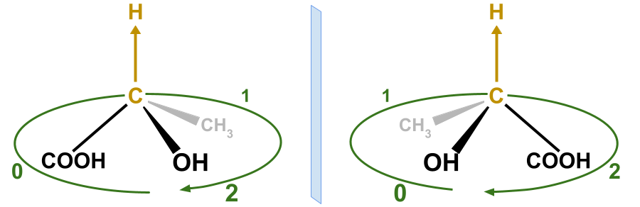
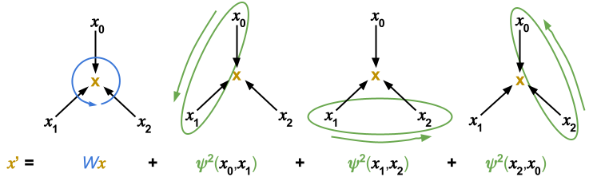

# ChiENN: Embracing Molecular Chirality with Graph Neural Networks

This repository contains the code for the paper [ChiENN: Embracing Molecular Chirality with Graph Neural Networks]() by Piotr Gaiński, Michał Koziarski, Jacek Tabor, Marek Śmieja. The repository contains two modules:
- `chienn` that implements `ChiENNLayer` and `ChiENNModel` along with data pre-processing functions.
- `experiments` that contains the code for reproducing experiments from the paper.

## ChiENN overview
ChiENN is a neural network that can distinguish between chiral molecules and their mirror images in a meaningful way. It implements order-sensitive message-passing scheme. First, the order of neighbors around a node is established, then the neighbors are aggregated in a way that is sensitive to the order.

### Neighbors' order
An intuitive illustration of the neighbor ordering in a molecule. First, we pick
a directed bond from atom C to H and then order the rest of the neighbors around
that bond. We observe that for a chiral molecule (left) and its mirror image (right), we
obtain different orders of the COOH, CH3, and OH constituents.


### Order-sensitive aggregation scheme
An illustration of our update rule for node x with 3 ordered neighbors
(x0, x1, x2) and for k = 2. We see that ψk is used to embed pairs of consecutive
nodes.



## Environment setup

```bash
conda create -n chienn python=3.9
conda activate chienn

conda install pytorch=1.10 -c pytorch -c nvidia
conda install pyg=2.0.4 -c pyg -c conda-forge
conda install rdkit -c conda-forge

conda clean --all
```


## Running ChiENN with example code
```python
from chienn import smiles_to_data_with_circle_index, collate_with_circle_index
from chienn.model.chienn_model import ChiENNModel

# Initialize the model for k=3 from eq. (4) from the paper.
k_neighbors = 3
model = ChiENNModel(k_neighbors=k_neighbors)

# Create a batch with two enantiomers.
smiles_list = ['C[C@H](C(=O)O)O', 'C[C@@H](C(=O)O)O']
data_list = [smiles_to_data_with_circle_index(smiles) for smiles in smiles_list]
batch = collate_with_circle_index(data_list, k_neighbors=k_neighbors)

# We observe that the output is different for the two enantiomers.
output = model(batch)
assert output[0] != output[1]
```

## Using ChiENNLayer in your own GNN:
If you want to use `ChiENNLayer` in your own GNN, you need to add three simple steps to data pre-processing:
1. Embed every molecule in 3D space. It can be done using `smiles_to_3d_mol` function.
2. Add `circle_index` to every datapoint using `to_edge_graph` function.
3. Collate `circle_index` properly using `collate_circle_index` function.

```python
from chienn.data.edge_graph import to_edge_graph, collate_circle_index
from chienn.data.featurization import smiles_to_3d_mol

def smiles_to_data(smiles):
    mol = smiles_to_3d_mol(smiles)
    data = your_featurization_function(mol)
    return to_edge_graph(data)


def collate(data_list):
    batch = your_collate_function(data_list)
    batch.circle_index = collate_circle_index(data_list)
    return batch


k_neighbors = 3
model = YourGNNWithChiENNLayer(k_neighbors=k_neighbors)
smiles_list = ['C[C@H](C(=O)O)O', 'C[C@@H](C(=O)O)O']
data_list = [smiles_to_data(smiles) for smiles in smiles_list]
batch = collate(data_list, k_neighbors=k_neighbors)

output = model(batch)
assert output[0] != output[1]

```

## Citation

If you find this work useful, please cite our paper:
```bibtex
@article{chienn,
  title={{ChiENN: Embracing Molecular Chirality with Graph Neural Networks}}, 
  author={Gai{\'n}ski, Piotr and Koziarski, Micha{\l} and Tabor, Jacek and {\'S}mieja, Marek},
  journal={arXiv preprint arXiv:2307.02198},
  year={2023}
}
```
